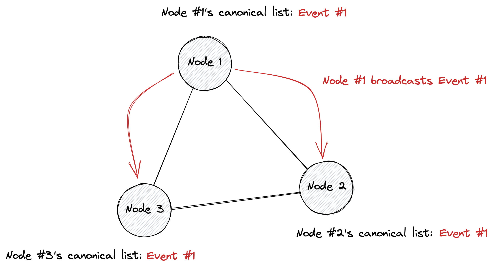
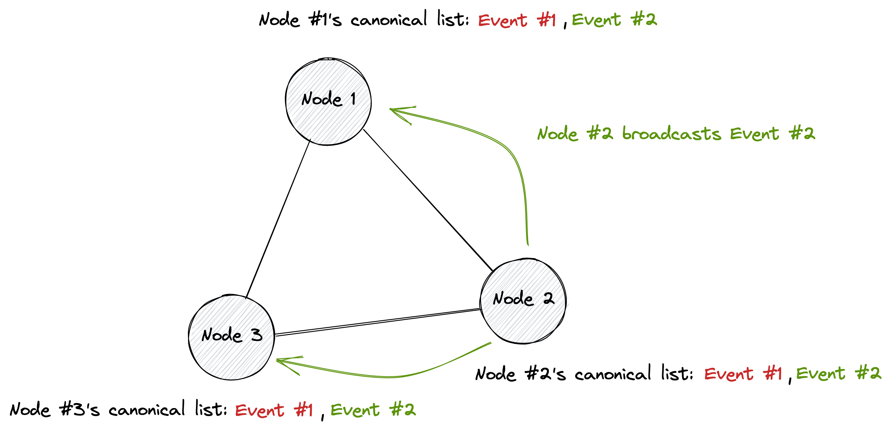
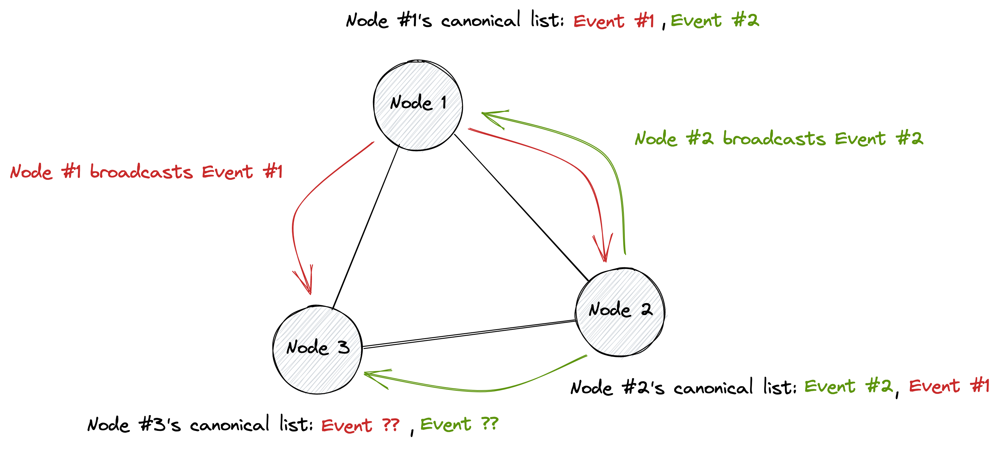
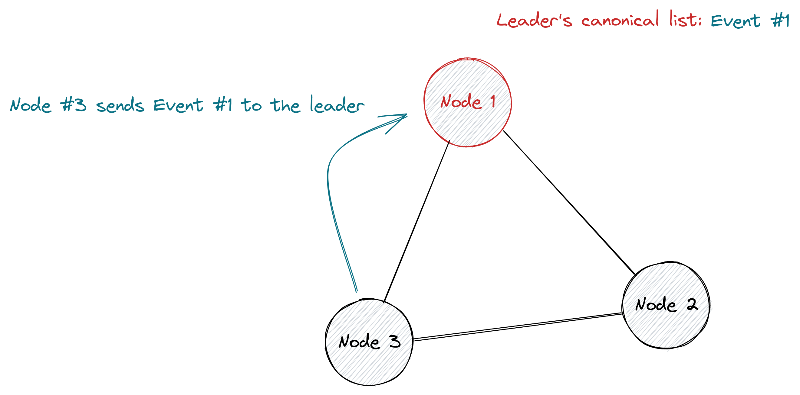
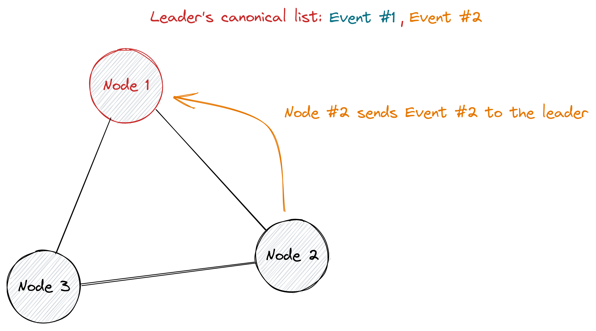
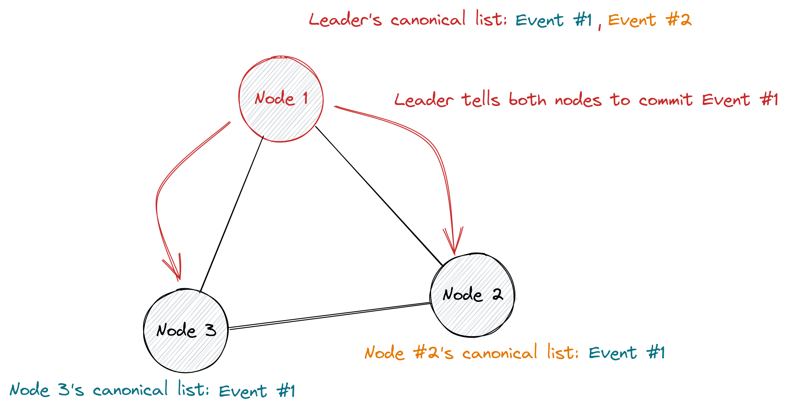
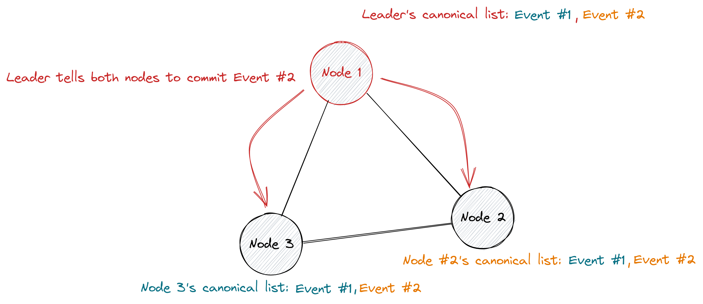
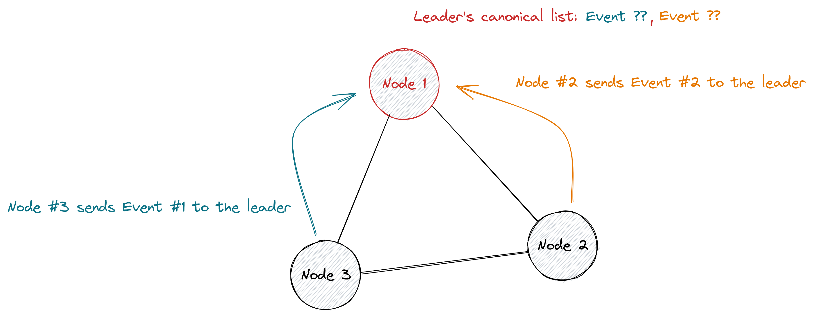
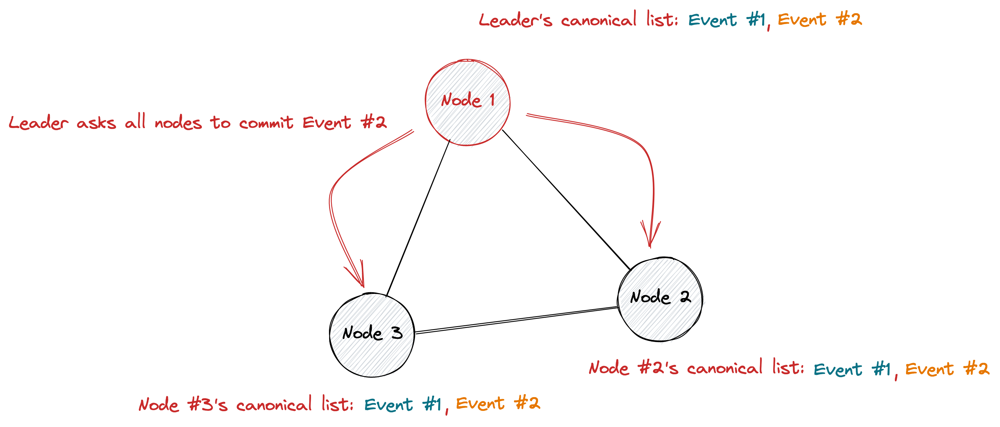

# {{ $frontmatter.title }}

In this section, we'll work to develop a simple consensus mechanism that can properly function under perfect conditions. After we've created this foundation, we'll introduce new problems and attack vectors and update our mechanism accordingly. For now, though, it's best to start with a simple core that can begin to explain the basics of consensus.

## Restating the goal

Let's briefly restate the goal of our mini consensus mechanism. We have a series of nodes (computers) that are interacting with one another over a network. We want to develop a system in which these nodes can talk to one another and come to an agreement (consensus) about the ordering of some set of "events". For now, let's not worry about what these events represent and simply assume that we want to come to agreement over their ordering.

## Initial setup

Let's start simple and try to create a consensus protocol that works for a network with only three nodes. Each of these nodes are connected to every other node. We're going to make two key assumptions that will have a large impact on our the type of protocols we can construct:

1. Nodes will always perfectly follow the prescribed protocol (no faults).
2. It takes some small random amount of time for messages to travel across the entire network.

  

## A naive protocol

Let's start by describing a naive protocol and then examine why the protocol is broken. One of the simplest protocols we could construct would be to have almost no protocol at all. So, let's build a minimal protocol:

1. Every node on the network is allowed to broadcast events whenever they want.
2. Whenever a node receives an event, they add that event to their canonical list of events.

### A working example

Let's first look at an example where this protocol seems to work perfectly well. First, Node #1 is going to broadcast a Event #1 to the other nodes on the network.

  

Great! Event #1 was received successfully by Nodes #2 and #3. All of our nodes have the same canonical list of events and our consensus protocol appears to be working correctly. Now Node #2 is going to broadcast Event #2.

  

Looks like we're still good here. Nodes #1 and #3 both received Event #2, and all of the nodes on the network still share the same canonical list of events.

### A broken example

It looks like our basic consensus mechanism is working just fine. So why isn't this good enough? Let's take a look at a slightly trickier example that breaks our consensus mechanism. Previously we looked at examples where only one node was sending a message at a time. Unfortunately, things get messy when multiple nodes are sending messages at once. Let's suppose that Node #1 is sending Event #1 at the same time that Node #2 is sending Event #2.

  

Now things are really confusing. Node #1 decided to store Event #1 first and then broadcast it to the rest of the network. Node #1 then received Event #2 and stored after Event #2. However, from the perspective of Node #2 this whole thing happened in reverse. Node #3 is also in trouble since the order in which these events are received depends entirely on the random communication delay between the two nodes. We've fallen out of consensus! 😭

## A robust protocol

Looks like our simple protocol is broken. A little bit of random chance (two nodes happening to send messages at the same time) and the reality of our basic assumptions (network delay) has put a hole in our protocol. We'll need to come up with something a bit better if we want to maintain consensus in all network conditions allowed by our initial assumptions.

### Selecting a leader

Although you could probably come up with other ways to solve the problem we just discovered, we'll be using one of the simplest approaches. We're going to select one of our nodes to act as the "leader" of our consensus protocol. Our leader is going to be responsible for progressing the state of the system.

We're going to tweak our original protocol as follows:

1. Every node can send event to the leader whenever they want.
2. The leader will store events in its canonical list in the order they were received.
3. The leader will re-broadcast these events in the order they were received.
4. The leader will wait longer than the network delay between sending out events.
5. Nodes only store events in their canonical list when received from the leader.

  

### Another simple example

Let's look at how this protocol works in practice. Our naive protocol worked perfectly well when only one node was sending messages at a time, so let's make sure our new protocol can handle the same situation. Here we'll have Node #3 first send Event #1 over to the leader.

  

The leader has Event #1 stored in its local list, but none of the other nodes have stored anything. Now, Node #2 is going to send Event #2 to the leader.

  

Just like before, the leader stored Event #2 in its own canonical list but none of the other nodes have done anything. Now here's where the magic happens. The leader is going to tell both of the nodes to commit some events to their canonical list in the order they were received. First, they'll be told to commit Event #1.

  

So far, so good. Both nodes have Event #1 stored locally. Next they'll be told to commit Event #2.

  

Perfect! All three of our nodes have the same canonical list of events. Of course, this isn't too impressive since our naive protocol could do this too. But it's nice to know that this mechanism actually works.

### Staying undefeated

Now it's time to put our protocol to the same test that our naive mechanism failed. We're going to have several nodes sending messages at the same time. Here, Node #3 is going to sent Event #1 to the leader at the same time that Node #2 sends Event #2 to the leader.

  

At this point, it's unclear whether Event #1 or Event #2 got to the leader first. However, we'll show in a second that the order of the incoming events doesn't have an impact on the correctness of the protocol. So, for the moment, we'll simply assume that Event #1 came first and Event #2 came second.

  

Now our leader will continue to follow the protocol. Based on the order in which these events came in, the leader will ask each other node to commit these events to their canonical list of events. In our current example, this means that the leader will ask all other nodes to commit Event #1 to their canonical list.

  

Great! Everything worked as expected. We'll repeat the same process for Event #2...

  

And, of course, everything worked out just fine. All of our nodes share the same canonical list, which means that our consensus mechanism worked. There might be a problem here if the leader quickly asked nodes to commit both Event #1 and Event #2 (because of our random network latency). However, our protocol tells the leader to hold off from sending a message until we're sure that the previous message would've been received by all other nodes on the network.

It's quite easy to imagine that this same protocol would work perfectly well if the leader had received Event #2 before Event #1. The only difference in the final picture would be that all nodes would share the list `[Event #2, Event #1]` instead of `[Event #1, Event #2]`. We still have consensus, even though the end result is different.

### Making it official

The robust mechanism we just constructed should work perfectly under the conditions we laid out. No matter how many nodes exist on the network, and no matter how many events these nodes are sending at the same time, the existence of a single leader will always guarantee that the network comes to consensus. In an effort to be more exact, let's briefly sketch out a proof that this does actually work.

Let's restate the basic protocol. The leader will receive events randomly from the network. The leader adds these events to its personal canonical list as they come in, so the leader is definitely in consensus with itself. The leader will, one by one, tell the network to commit each event in its canonical list (in order). When other nodes receive an event from the leader, they will commit that event to their canonical list.

Since there's a maximum network delay (a maximum amount of time that it takes a message to propagate across the network), the leader can be sure that the leader's events are received by all other nodes within this `network_delay`. Additionally, since all nodes are perfect and do not suffer from faults, the leader knows that after `network_delay` all nodes have correctly committed the event. The leader must simply wait for longer than `network_delay` to send the next event to the network to guarantee that events will always come in one particular order. Super simple!

## Recapping our work

So far we've created a simple consensus protocol that functions under very ideal network conditions. Of course, this protocol really does only work under the very tight conditions that we've defined in this section. If we want to be able to handle more realistic scenarios, we'll need to introduce some more features to our consensus protocol. In the next section, we'll introduce the idea of **crash faults** where nodes cease to function entirely and start to cause some chaos on the network.
