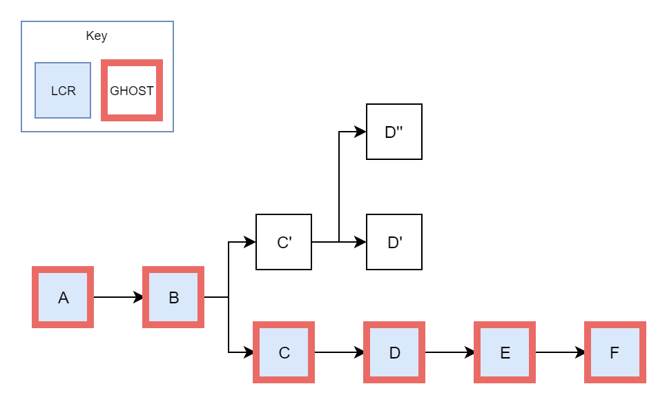

## Consensus Mechanisms
All blockchain systems must define some process through which new blocks can be added to the chain. Indeed, without such a process, the blockchain fails to progress and is, effectively, useless.

This process is often referred to as the "consensus mechanism" of the blockchain. We are, after all, "coming to consensus" about the ultimate state of the system. Though we can define many different consensus mechanisms, all such processes rely on the existence of a metric through which the weight of a user's influence over the system can be measured.

Users of blockchain systems are identified digitally. One may be familiar with the concept of unique identification in the context of state-provided identification documents. These systems are able to assign unique IDs to individuals because their view is centralized. Given enough trusted data points, states can detect attempts to create multiple identities with relatively good accuracy.

A decentralized identity system robust to sybil attacks is quite difficult to realize. Many attempts have been made, but no single project has gained traction at a scale on part with state-run programs.

As such, blockchain systems most typically operate under the assumption that users may create as many identities as they please. Of course, this assumption effectively disqualifies "one person, one vote" consensus mechanisms. Without the ability to accurately assign one identity to each user, we cannot be sure that each person only has one vote.

Blockchains attempt to resolve this dilemma by making use of metrics that are provably scarce. That is to say, users cannot gain an advantage without expending resources. A user's influence over the system is directly proportional to their expenditure of some resource. Since the resource is scarce, the creation of a second identity would serve only to split an individual's resources between the two identities.

## Proof of Work
Early blockchain systems, including Eth1, found that computational resources could effectively be used as this scarce quantity. Particularly, it was discovered that certain mathematical operations produced entirely unpredictable results. These operations could therefore be used to create a "lottery" system, akin to rolling die in hopes of landing on a given lucky number.

This model, known as "Proof of Work," relies on mathematical operations called "hash functions." A hash function, in a basic sense, takes arbitrary data and maps it to a fixed-sized value. For instance, we can define an extremely simply hash function that maps all even numbers to zero, and all odd numbers to one.

```text
TODO: Image for basic hash function.
```

Blockchains make use of much more complex hash functions than the one just described. These functions map input values to very large values and are carefully constructed to provide certain properties:

1. It is computationally infeasible to find two input values that map to the same output value.
2. It is computationally infeasible to find an input value that maps to a specific pre-determined output value.

These properties mean that any given input value will effectively produce an entirely unpredictable output value. From this observation, we can create a "lottery" in which a user attempts to find an output value less than or equal to some target value.

A simplified version of such a lottery could be implemented with a hash function that produces output values between zero and 100. If our lottery requires that the output value be less than five and output values are entirely random, then it takes, on average, 20 attempts to find a winning input.

Proof of Work operates on the same basis, though the numbers used are significantly larger. Bitcoin currently requires, for instance, on the order of trillions of attempts to "win" the block production lottery.

Since each hash takes a finite amount of time to compute, a user can speed up their search by employing more than one machine at the same time. As a result, the probability of winning this lottery generally reflects the level of monetary investment in the machines used to participate.

In the context of a blockchain, this lottery system must somehow produce new blocks. Instead of hashing arbitrary values, therefore, users are required to hash specific blocks. Users modify a value within the blocks (the nonce) to create the various inputs necessary to generate new random outputs. Once a user finds a block with the correct target hash, the user publishes the block to a network of users.

This mechanism ensures that blocks can only be created by expending sufficient resources. We now also need to incentivize users to actually expend these resources. We do so by giving the block producer a reward in the form of some digital scarce resource on the blockchain. Note that generally, this means block producers will only expend as many resources as is profitable given the current value of the reward.

## Fork Choice Rules
Since the reward takes the form of a resource on the blockchain itself, the reward is only valuable if the block is part of the "canonical" chain. If a fork in the network can cause a chain with less associated expenditure to become "canonical," our reward scheme breaks entirely. Therefore, the decision as to which chain is canonical must also be based on resource expenditure. Any rule used to determine which chain is canonical among a set of forks is called a "fork-choice rule."

### Longest Chain Rule
Most Proof of Work blockchains make use of a specific fork-choice rule known as the Longest Chain Rule. Contrary to the name, the Longest Chain Rule does not simply follow the chain with the most blocks. Instead, the Longest Chain Rule follows the chain with the most cumulative difficulty.

The Longest Chain Rule defines the following algorithm for finding the head of the canonical chain:

1. Begin at the genesis block.
2. Find all available forks.
3. Pick the fork with the highest total difficulty.

We can demonstrate the Longest Chain Rule with a simple fork:


The Longest Chain Rule ensures that the canonical chain at any given point in time is supported by the highest computational resource expenditure. 

```text
TODO: Relate LCR to GHOST.
```

### GHOST
**GHOST** (Greedy Heaviest Observed Subtree) is an alternative to the longest-chain rule. GHOST, unlike the LCR, doesn't simply look at the length of a chain, but also factors in any **uncle blocks**.

An uncle block to a chain is any block that *builds upon some block in that chain*, but isn't actually part of the chain itself. Let's go through this by example. In the following diagram, duplicated from above, we have a fork at `Block A`:


Here, we say that `Block B'` is an *uncle of the chain headed by* `Block D` because it builds on one of its components (in this case, `Block A`).

Uncle blocks are not unusual occurrences. The main Eth1 chain is currently approaching ten million blocks in length and has almost *one million* uncles. But why do we care about them?

Though uncle blocks don't directly add to the length of a chain, they *do* imply that the creator of the uncle block meant to extend that chain. Which chain would you follow, a chain with two blocks and no uncles or a chain with one block and a thousand uncles? If we simply ignore uncle blocks, then we're "wasting" the work put into these blocks by their creators. 

Here's how GHOST finds the "best" fork to follow:

1. First, we start at the genesis block.
2. Next, we look at all of the available forks from the current block, if any.
3. If there are no more blocks in the chain, we select the current block as the head of our chain and stop our search.
4. If we only have one potential chain (no forks), then we move onto the next block.
5. If we have more than one potential chain (a fork), then we move on to the first block of the fork with the most *total* blocks, including uncle blocks.
4. Head back to step (2) with our current block.

#### GHOST vs. LCR
GHOST often agrees with the longest-chain rule:



Here, the LCR picks `Block F` because it's part of the longest chain (six blocks in total). Our GHOST rules really only apply at `Block B`, where we have our first fork. The chain after `Block C'` has a total of three blocks, whereas the chain after `Block C` has a total of four blocks. GHOST therefore moves onto `Block C` and doesn't find any other forks until stopping at `Block F`.

However, in some cases, GHOST will disagree with the longest-chain rule: 


In this chain, the LCR picks `Block G` because it's part of the longest chain (seven blocks). GHOST diverges from the LCR after `Block B`. Although the chain following `Block C` is longer at five blocks, there are a total of *six* blocks in the fork starting at `Block C'` when we count uncle blocks.
