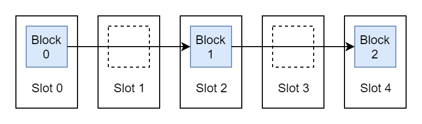

Blocks and slots and epochs, oh my!

Eth2 introduces a lot of new terminology into the crypt-o-sphere. It's easy to get overwhelmed sometimes, and that's okay. We're going to tackle this thing, one new definition at a time.

We're going to kick off our deep dive into Eth2 by exploring the structure of the **Beacon Chain**, the beating heart at the center of the Eth2 ecosystem. The Beacon Chain is where the magic happens. Without the Beacon Chain, there is no Proof of Stake, there are no blocks, and, most importantly, there is no Eth2.

So what exactly *is* this Beacon Chain? What does it do? What does it *not* do? What's it made of? Can I at least *touch* it?

By the time you're done with this chapter, you should have all the answers to at least four of these questions. We're still working on that last one.

## Blocks
Let's get right into it. The Beacon Chain is a blockchain and, perhaps unsurprisingly, is composed of **blocks**. Each block within the Beacon Chain references a previous block, its **parent** block. This creates a link between the block and its parent, which ultimately creates a *chain* of blocks.

If every block references a parent block, what does the very first block reference? Who watches the Watchmen? Well, since there needs to be at least *one* block to kick off the chain, we designate a special starting block that doesn't have a parent. We often refer to this first block as the **genesis** block, and it's used to bootstrap a lot of the system.

If you're familiar with Bitcoin or Ethereum, you might know that blocks contain **transactions**. These transactions can accomplish simple tasks like sending crypto to another user, or more complex operations like interacting with blockchain-based applications.

The Beacon Chain is somewhat different from these blockchains in that it only really handles "housekeeping" tasks for the rest of the ecosystem. We'll talk more about applications, like those you might use on Ethereum today, when we get to the topic of **Shard Chains** in Phase 1 and Phase 2. Even though the Beacon Chain doesn't run these applications directly, it handles all of the critical logic that makes these Shard Chains possible.

## Slots
We can't have a blockchain unless *someone* is creating new blocks. **Validators** are users responsible for creating blocks on the Beacon Chain. Anyone can become a validator by investing a certain amount of ETH into the system.

Blocks are created during fixed periods of time called **slots**. Currently, these slots are 12 seconds long. The Beacon Chain assigns a single validator to each one of these slots, and only an assigned validator has the right to create a block during their assigned slot.

A slot is basically like a validator's place in the line to create a block. Validators wait until their number is called, create a block according to some rules, and send that block off to the rest of the world. If a validator doesn't show up on time when their number is called, then the next validator takes their place instead.

Validators can figure out when their number is going to be called by looking at the amount of time passed since the creation of the genesis block. For example, if each slot is 12 seconds long and the genesis block was created 1200 seconds ago, then the current slot is `1200 seconds / 12 seconds = slot 100`.

It's worth noting that, although we often use slots to reference to specific Beacon Chain blocks, we still maintain the traditional idea of block height. The height of a block is equal to the number of blocks between it and the genesis block, plus one. For instance, in the above diagram, there's one block (`Block 1`) between the genesis block (`Block 0`) and `Block 2`. Therefore, the height of `Block 2` is 2.

## Epochs
Slots are relatively short periods of time. Sometimes, however, we want to carry out big tasks on a regular interval. Many of these tasks would be too difficult to execute every 12 seconds, so the Beacon Chain defines longer chunks of time called **epochs**. 

Epochs are composed of a specified number of slots, and are currently set to be 32 slots. Epochs don't overlap, so the very first epoch is made of blocks 0-31, the second of blocks 32-63, and so on. Using the current slot time of 12 seconds, the amount of time elapsed within each epoch is `12 seconds per slot * 32 slots per epoch = 6.4 minutes per epoch`. As with slots, we can determine the current epoch by looking at the amount of time elapsed since the creation of the genesis block.

Epochs are markers for several important events in the life-cycle of the Beacon Chain. For instance, certain accounting tasks are only executed at the start of a new epoch. Generally, we use epochs for tasks that need to happen on a regular basis, but are too complex or expensive to perform within every slot. We'll talk more about the specifics of these tasks in a later chapter.

### Epoch Boundary Blocks
Sometimes we'll want to perform a task at the start of an epoch. When we do this, we want to reference not only the epoch, but a specific block within that epoch that we're operating on. We call this block the **epoch boundary block**, or EBB for short.

We usually want to execute our tasks right after the first slot of a new epoch. If the validator assigned to this first slot shows up and creates a block, then we're in luck. This block is a logical first choice for our epoch boundary block.

For example, in the above diagram, epoch boundary block for `Epoch 1` is `Block Z`. Easy enough.

However, it's always possible that the validator assigned to the first slot in an epoch won't show up. So, if no block was created in the first slot of an epoch, then we just use the latest known block from any previous slot to fill the gap.

Here, the validator assigned to `Slot 64` didn't show up, so we don't have a block for that slot to use as an epoch boundary block. Instead, we use the last block created before `Slot 64`, `Block Y`, as our boundary block.

Our little diagram refers to the boundary block as "`Block Y` at `Slot 64`". You might hear others talk about boundary blocks in this way, and it can be confusing because `Block Y` was created at `Slot 63`, not `Slot 64`. We're not actually *moving* `Block Y` out of `Slot 63` and into `Slot 64`, but only using `Block Y` as a *stand-in* for the block that should've been created at `Slot 64` but wasn't.

## On to the Next One
Whew, that was a lot of terminology. We're getting there.

Let's run through a quick recap. The Beacon Chain is run by **validators**, who are responsible for creating **blocks** during **slots**. Validators also perform certain tasks on the longer time-frame of **epochs**. We identify specific epochs using **epoch boundary blocks**. That's the basic structure of the Beacon Chain!

We know that the Beacon Chain assigns validators to specific slots, but we haven't discussed *how* the Beacon Chain actually does that. Next, we're going to learn all about **randomness** and how the Beacon Chain uses it to assign roles to validators.
