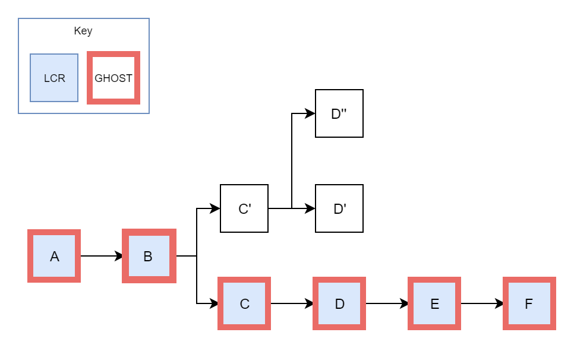
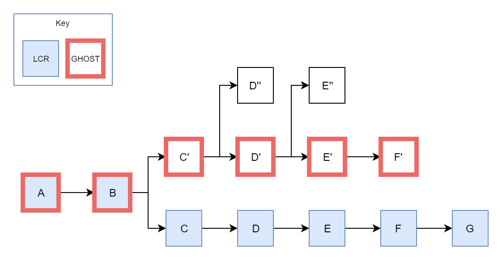

Whenever we have blockchains, we have **forks**. Forks, in a general sense, are points at which multiple blocks reference the same parent.


Blockchains can fork for any number of reasons. Though forks are often presented as contentious events, most forks are relatively short-lived and occur naturally as a result of menial things (like network latency). Forks present us with two potential versions of history, so it's important that we only pick one. But which do we pick?

Whichever fork we choose to follow, the method we use to determine the "valid" fork is called our "fork-choice rule."

## An Old Friend: The Longest-Chain Rule
The very first fork-choice rule was Bitcoin's "**longest-chain rule**," or the LCR. The LCR tells us, as we might infer from the name, to follow the longest chain:


Since Proof of Work blocks take a lot of computational resources to produce, this method gives us a relatively strong assurance that we're following the chain with the most invested value. However, the LCR leaves plenty to be desired.

## GHOST
**GHOST** (Greedy Heaviest Observed Subtree) is an alternative to the longest-chain rule. GHOST, unlike the LCR, doesn't simply look at the length of a chain, but also factors in any **uncle blocks**.

An uncle block to a chain is any block that *builds upon some block in that chain*, but isn't actually part of the chain itself. Let's go through this by example. In the following diagram, duplicated from above, we have a fork at `Block A`:


Here, we say that `Block B'` is an *uncle of the chain headed by* `Block D` because it builds on one of its components (in this case, `Block A`).

Uncle blocks are not unusual occurrences. The main Eth1 chain is currently approaching ten million blocks in length and has almost *one million* uncles. But why do we care about them?

Though uncle blocks don't directly add to the length of a chain, they *do* imply that the creator of the uncle block meant to extend that chain. Which chain would you follow, a chain with two blocks and no uncles or a chain with one block and a thousand uncles? If we simply ignore uncle blocks, then we're "wasting" the work put into these blocks by their creators. 

Here's how GHOST finds the "best" fork to follow:

1. First, we start at the genesis block.
2. Next, we look at all of the available forks from the current block, if any.
3. If there are no more blocks in the chain, we select the current block as the head of our chain and stop our search.
4. If we only have one potential chain (no forks), then we move onto the next block.
5. If we have more than one potential chain (a fork), then we move on to the first block of the fork with the most *total* blocks, including uncle blocks.
4. Head back to step (2) with our current block.

### GHOST vs. LCR
GHOST often agrees with the longest-chain rule:



Here, the LCR picks `Block F` because it's part of the longest chain (six blocks in total). Our GHOST rules really only apply at `Block B`, where we have our first fork. The chain after `Block C'` has a total of three blocks, whereas the chain after `Block C` has a total of four blocks. GHOST therefore moves onto `Block C` and doesn't find any other forks until stopping at `Block F`.

However, in some cases, GHOST will disagree with the longest-chain rule: 



In this chain, the LCR picks `Block G` because it's part of the longest chain (seven blocks). GHOST diverges from the LCR after `Block B`. Although the chain following `Block C` is longer at five blocks, there are a total of *six* blocks in the fork starting at `Block C'` when we count uncle blocks.

## LMD-GHOST
GHOST chooses between different forks depending on the total number of blocks in each fork. This method works well within a Proof of Work environment where blocks are difficult to produce.

Proof of Stake validators, however, need only create a single signature to produce a block. If we simply looked at the total number of blocks in a chain, then a validator could easily attack the network by creating many blocks in a row:


`Validator B` causes GHOST to pick their own chain by producing a few blocks in a row. We obviously don't want a single validator to be able to attack the network this way, so Eth2 introduces a minor modification to the traditional GHOST algorithm. Instead of looking at *every* message in the network, we only look at the *latest* messages from each validator. Hence, "Latest Message Driven GHOST," or LMD-GHOST.

Let's see how LMD-GHOST deals with the previous example:


Since we're only considering the *latest* message from each validator, we only count a single block created `Validator B`. As a result, LMD-GHOST ignores the longer chain and correctly lands on the block created by `Validator D`.

### Saved-Message Attacks
```text
TASK: Explain the attacks in more detail, including diagrams.
```

Validators are only allowed to make a single vote per epoch. However, validators could still attempt to circumvent this system by withholding votes from previous epochs and releasing them all at once in a later epoch. LMD-GHOST won't count two votes from the same validator on the same chain, but it will allow a validator to flip-flop between two different chains.

We generally limit this sort of attack by requiring that clients ignore any votes older than the previous epoch. We only take into account votes made in the current or previous epoch. 

### Interactions with Casper FFG
```text
TASK: Move this section into Casper FFG, since the order has flipped.
```

```text
TASK: Explain the logic behind this interaction.
```

```text
TASK: Go through an example of the interaction with FFG.
```

LMD-GHOST doesn't allow validators to circumvent blocks finalized by Casper FFG. In order to accomplish this, we run LMD-GHOST according to the following process:

1. Find the last finalized block.
2. Find the highest-epoch justified block that is a descendent of the finalized block.
3. Run LMD-GHOST from the block found in step (2).
