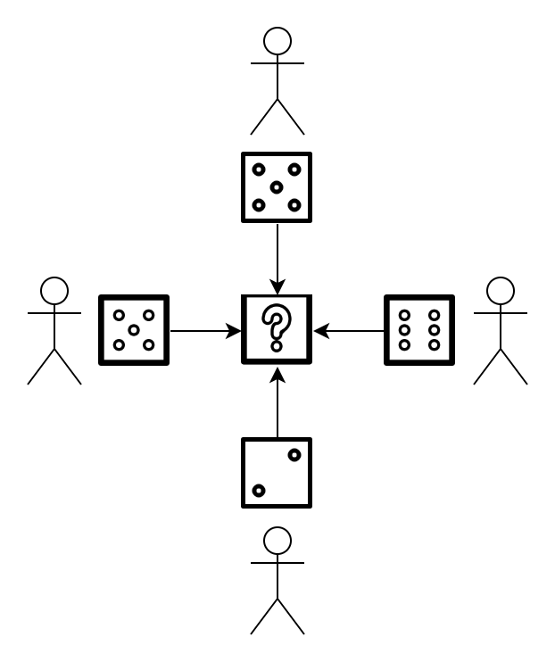

# {{ $frontmatter.title }}

## Wait, What *is* Randomness?

Our lives seem to be punctuated by an endless stream of random events. Whether we're thinking about packing an umbrella for that trip next week, or just sitting down for a game of D&D, we're taking small gambles every day.

Though not without its faults, randomness bestows upon us many of our greatest joys. Without it, life would be entirely predictable and, perhaps, unbearably mundane. In many ways, we're truly lucky when we're able to say that tomorrow holds unknown possibilities.

But what exactly *is* randomness? We might have an intuitive feel for the meaning of the word "random," but most of us would probably have a difficult time explaining the concept in detail. So, let's explore the idea of randomness in a little more depth.

### Randomness is Qualitative

A dictionary might describe randomness as something that has a quality of unpredictability, fitting for the highly chaotic experiences of human life. It seems, though, that certain things are simply "more random" than others. Weather patterns, for example, can seem very random, but we're able to predict them to at least *some* extent. Lottery outcomes are pretty random, but ask anyone to pick a random number between one and ten, and they're probably going pick seven.

When we talk about an event being "random," or something presenting "randomness," therefore, we're actually making a *qualitative* statement. So, when we say that something is "more" random than something else, we're talking about exactly *how* unpredictable a given event might be. The weather is, clearly, much more predictable than the lottery. Or my sleep schedule.

Furthermore, we might be using randomness, like our computers do, as a way to defend ourselves against others. In these cases, we're also interested in understanding the ability for someone to "bias," or manipulate, our randomness. If someone can very successfully manipulate our source of randomness, then we might *think* that it's random when it's really being carefully controlled. The ability of someone to bias our randomness too, however, is a spectrum.

### Randomness in Computing

Computers are usually meant to execute programs in expected, or deterministic, ways. We typically want our programs to generate the same output when given the same input. Our lives would be much more difficult if our computers started behaving in completely "random" ways.

Our computers do still, clearly, rely on random numbers for a lot of important functionality. For instance, computers need access to random numbers in order to generate Ethereum private keys. Otherwise, anyone else could easily reproduce the behavior of our computer and, therefore, reproduce our private keys. Clearly there must be some way for computers to generate "randomness."

Computers generally rely on the idea of "reasonably unpredictable" external inputs in order to generate random numbers. For instance, a program might derive random numbers from the movement of your mouse over a period of time. Mouse movements are generally very unpredictable, so it's unlikely that any two people will move their mice across their screens in exactly the same way. Cursors can take so many potential paths across a screen that it's also infeasible for an algorithm to "guess" which movements you used to generate a given random number.

Unpredictable inputs can take many different forms. [Random.org](https://random.org) generates random numbers from the chaotic radio noise generated by natural processes in our atmosphere. CloudFlare, an internet infrastructure company, famously derives randomness from a camera pointed at a wall of lava lamps. We have no shortage of potentially "random" inputs for our computers.

### Randomness in Blockchains

Random inputs are effective for traditional computers because we trust them to behave in some expected way. CloudFlare's lava lamps wouldn't be very effective if the live-stream were frozen. Mouse movements wouldn't be useful if someone could hack our mouse to lie to our computer about where the cursor has been.

Although we usually don't worry about these things in our personal computers, we definitely need to consider them in the context of a blockchain. Let's explore how this might work in the context of Ethereum.

Ethereum, unlike the computers we're familiar with, is isolated to the outside world. Data can only enter Ethereum via **transactions**. In order to insert a random number into Ethereum, therefore, someone would have to be responsible for creating the transaction that holds this random number. However, if we assign this job to a single individual, then we have no way to know whether they're *really* publishing random numbers or just publishing numbers that *look* random. Maybe they're publishing the specific "random" number that just happens to win them a game of Ethereum-based poker.

People have been tackling this problem for a long time. Solutions are varied, but they generally tend to center around the idea of minimizing the ability for any *one* individual to manipulate the random number. Usually, solutions achieve this by having many different individuals collectively create a random number.

## Enter: RANDAO

RANDAO is a mechanism for generating "reasonably random" numbers in a decentralized way. The core idea behind RANDAO is to have a large group of people come together to generate a random number, instead of simply trusting one person to do it on everyone's behalf.

The simplest version of RANDAO is to have each member of a group come up with a random number on their own. We can then take these random numbers and "mix" them together in a way that each person's number has an equal impact on the final result.

### Mixing Functions

RANDAO systems need some sort of "mixing" function that input values from each participant and produces some output value. In a very high-level sense, mixing functions always take the form:

$$\text{mix}(\text{input}_1, \text{input}_2, \ldots, \text{input}_n) \rightarrow \text{output}$$

Where each $\text{input}$ value corresponds to a number contributed by a RANDAO participant.

When picking a mixing function, we need to be careful to preserve the key property that each input value has equal "influence" on the output value. We can get an intuitive feel for this property by looking for "bad" mixing functions. We clearly want to avoid, for example, mixing functions that completely throw out every second input value or simply always return the same constant output value.

::: tip NOTE A more rigorous explanation of mixing functions can be found at https://tools.ietf.org/html/rfc4086#section-5 :::

::: tip QUESTION Should we go into further detail about the mathematical concepts behind a "strong" mixing function? :::

The inputs to our RANDAO system are numbers, so we can represent them as strings of zeros and ones (bits). We can therefore create a simple mixing algorithm with the Exclusive Or ("XOR," written mathematically as $\oplus$) function, which takes two input bits and produces a single output bit according to the following table:

| Input 1 | Input 2 | Output |
| ------- | ------- | ------ |
| 0       | 0       | 0      |
| 0       | 1       | 1      |
| 1       | 0       | 1      |
| 1       | 1       | 0      |

For example, reading from our table, $1 \oplus 0 = 1$.

Our RANDAO inputs are typically going to be larger than just a single bit. When operating on inputs with multiple bits, we use the same notation:

$$ 1010 \oplus 1001 = \text{?} $$

However, we apply the XOR operation "bitwise," i.e., we compute the nth bit of the output as the XOR of the nth bit of each input. For instance, from our above formula, the first bit of our output will be equal to $1 \oplus 1 = 0$.

Completing this calculation bit-by-bit:

$$ \begin{aligned} 1 \oplus 1 = 0 \\ 0 \oplus 0 = 0 \\ 1 \oplus 0 = 1 \\ 0 \oplus 1 = 1 \end{aligned} $$

Which gives us:

$$ 1010 \oplus 1001 = 0011 $$

We can also perform XOR operations on multiple inputs by moving from left to right:

$$ \begin{aligned} 01 \oplus 10 \oplus 00 = \\ (01 \oplus 10) \oplus 00 = \\ 11 \oplus 00 = \\ 11 \end{aligned} $$

Using our knowledge about XOR, we can create a simple RANDAO mixing function as follows:

$$ \text{input}_1 \oplus \text{input}_2 \oplus \ldots \oplus \text{input}_n = \text{output} $$

Let's go through this mixing function by diving into an example. We're going to use this function as part of a RANDAO system with four participants. Each of our participants gets to pick a random number by selecting eight random bits (corresponding to the integers 0 - 255 when converted to decimal).

Our participants give us 00110101, 11110011, 00001010, and 10110100 as inputs, so our mixing function need to determine:

$$00110101 \oplus 11110011 \oplus 00001010 \oplus 10110100 = \text{?}$$

We compute our XOR values left-to-right:

$$ \begin{aligned} 00110101 \oplus 11110011 \oplus 00001010 \oplus 10110100 = \\ ((00110101 \oplus 11110011) \oplus 00001010) \oplus 10110100 = \\ (11000110 \oplus 00001010) \oplus 10110100 = \\ 11001100 \oplus 10110100 = \\ 01111000 \end{aligned} $$

And our final random value is, therefore, 01111000.

This XOR mixing algorithm isn't our only option, of course. We can also use a cryptographic hash function to combine the various input elements:

$$\text{hash}(\text{input}_n + \text{hash}(\text{input}_{n-1} + \ldots \text{hash}(\text{input}_2 + \text{input}_1))) = \text{output}$$

### Attacking RANDAO

We've gone through a basic RANDAO demonstration, but our system has a fatal flaw. If our participants can see the inputs from other participants, then the very last participant to submit an input has a massive advantage.

Let's demonstrate how someone might execute this attack against our simple XOR system. We'll use the same example of four participants, and our first three participants have chosen the same original values (00110101, 11110011, and 00001010).

Our last participant can see these three values, so they can easily compute the current result of our mixing function:

$$ \begin{aligned} 00110101 \oplus 11110011 \oplus 00001010 = \\ (00110101 \oplus 11110011) \oplus 00001010 = \\ 11000110 \oplus 00001010 = \\ 11001100 \end{aligned} $$

Our attacker can easily pick an input to change the output into any value they'd like. For example, if our attacker wants to generate an output value of 11111111, they can simply flip each of the bits (turn each zero into a one) in the current value:

$$ 11001100 \oplus 00110011 = 11111111 $$

The attacker can use this same method to pick any output number they'd like. Clearly this isn't a very good way to generate random numbers.

If we use the mixing algorithm with a hashing function, the attacker's task becomes a little more difficult. Let's use the same numbers as above to demonstrate.

$$ \begin{aligned} \text{sha256}(11110011 + 00110101) = 438f0d9d... \\ \text{sha256}(438f0d9d... + 00001010) = 5d2a20f5... \end{aligned} $$

An attacker now needs to find some input string that, when hashed alongside our current output, gives an output that starts with `FF`. Since `sha256` is designed so that it's effectively impossible to "guess" what its output will be, our attacker will need to test out a bunch of potential values. Interestingly, there is no possible 8 bit value that, when hashed alongside the output, gives us a value starting with `FF`! However, it is possible to get a value of 00000000 (starts with `00`) if we pick 01000101:

$$ \text{sha256}(5d2a20f5... + 01000101) = 00ec3dd5... $$

It's clear that certain mixing algorithms are better than others. Generally speaking, we prefer to use this hashing method because it's not as easy to "cheat" the final value. An attacker definitely needs to grind out potential values in order to find a specific interesting value.

One way to implement a commitment is simply to use a hash function:

$$ \text{commitment} = \text{hash}(value) $$

We can't get $\text{value}$ from $\text{commitment}$, but if we have $\text{possible\_value}$ then we can easily check that $\text{hash}(\text{possible\_value}) = \text{commitment}$ and therefore $\text{possible\_value} = \text{value}$.

For example, let's say our first participant gives a commitment using `sha256` of `86f3445a32f0f77fa03bfd481bf7d8a249f394e6301eaaa40a9eae205e2b43c9`. Later, they reveal their number to be `10100011`. We do a simple check and, indeed, the hash of `10100011` is `86f3445a32f0f77fa03bfd481bf7d8a249f394e6301eaaa40a9eae205e2b43c9`, and therefore the committed value was correct.

An issue with this sort of commitment scheme is that it requires the party actually create and give this commitment to other parties in advance. Another way to create commitments is to use a cryptographic signature that's deterministic. If we know all signatures are deterministic, then we can create a commitment out of the signature on some known value. For example, we can give everyone an order in the selection process and require that their input value be the signature of their position in the order. Since signatures are just 0s and 1s, we can parse this as a random input.

Here let's say that our first participant is required to make their input based on a signature on the number `00000001` (one). The participant gives the signature [TODO] and we `verify(signature, public_key, 00000001)`. If this check returns false, we reject the reveal as invalid.

So how do we fix this? We use an old schoolyard trick: get everyone to write down their numbers before putting them together.

Since we're in the world of computers, we're not actually using physical pieces of paper. Instead, we have everyone create a **cryptographic commitment** for their random number. Wait, a cryptographic what?

Okay, let's say you're playing a game of "guess the number" with a friend who likes to cheat. Your friend (secretly) picks the number "five," and you correctly guess it. Since this isn't a great friend, the (secret) number was suddenly "six" the whole time. You're suspicious, but you have no evidence.

You don't like losing to cheaters, so you have an idea. The next time you play, you make your friend whisper their (secret) number to another, mutually trusted, friend. No cheating this time, Marc.

Cryptographic commitments are, basically, the mathematical equivalent of whispering your random number to that second friend. Except without that necessary step of having friends in the first place. Cryptographic commitments "hide" a secret in a way that someone can't lie about the original secret later on. You can't figure out the secret from the commitment alone, but if you can *recreate* the commitment using the secret you're given, then that secret must've been the original.

Now our "commit-reveal" RANDAO process looks more like this:

Of course, as is always the case, there's one more flaw here. Cryptographic commitments stop someone from changing their number at the last second, but they don't actually force someone to reveal their number in the first place.

This flaw doesn't break RANDAO entirely, but it does make it somewhat subject to bias. The last person to reveal only gets one more attempt to find a favorable number. If the last `n` people to reveal are in cahoots, then they'll get a total of `2^n` attempts. Again, much better than the unlimited attempts in our version of RANDAO without commitments, but not perfect.

Generally speaking, though, "commit-reveal" RANDAO is "good enough" for the purposes of Eth2. The Beacon Chain runs RANDAO once every epoch. Within each block, the assigned validator reveals a commitment. At the end of every epoch, these revealed values are mixed together to produce a random number.

### An Aside: Verifiable Delay Functions

It's possible to improve upon the "commit-reveal" version of RANDAO using some more fancy math. Although not currently included in the official Eth2 specification, Verifiable Delay Functions, or VDFs, were developed by researchers at Stanford in 2018 to this end. VDFs are, effectively, algorithms that take a long time to execute and can't be sped up by running the algorithm on multiple computers at the same time.

VDFs have the following function signature:

$$ \text{input} \rightarrow (\text{output}, \text{proof}) $$

VDFs have a corresponding verification algorithm that, given `proof` tells us whether `output` is correct for the given `input`:

$$ (\text{input}, \text{output}, \text{proof}) \rightarrow \{true, false\} $$

Although it takes a long time to compute the `output`, it only takes a short period of time to use the `proof` to verify that the `output` was, indeed, correct. We can tune a parameter in the VDF to change the amount of time that an average computer will take to find an `output`.

VDFs are interesting in their own right, but they shine in combination with RANDAO. Instead of simply using the result of RANDAO as our random number, we can first feed this result into a VDF and use the `output` as our final random number.

So how does this help? Well, the attackers in our last example only really gain an advantage because they can easily check whether it's worth revealing their number or not. If we first limit the amount of time that people have to reveal their random numbers and then tune the VDF to take A Very Long Time™, then any would-be attacker shouldn't be able to see the effect of their reveal in time.

Of course, this is all fundamentally based on the idea the attackers don't have access to computer hardware that can compute VDFs very quickly. If an attacker somehow *is* able to determine the effect of their reveal before time is up, then we're back to good 'ol "commit-reveal" RANDAO. A VDF research group was recently coordinated with the goal of producing low-cost hardware that approaches the limits for VDF computation time. If this project is successful, then we may see VDFs officially introduced to Eth2 in the near future.

## Randomness in Eth2

We've talked a lot about randomness, and we now know how the Beacon Chain actally generate random numbers with the help of RANDAO. So what are these random numbers actually used for? Let's find out.

### Block Proposers

Blockchains don't work unless someone is around to produce blocks. Although there are many ways to select block producers in a Proof of Stake system, we generally want to maintain a few key properties.

First, we want the selection process to be fair to all of the validators. Blockchains generally give out a reward to block producers, so we want to ensure that validators are being paid in proportion to their investment in the system. A good block proposal mechanism should therefore make sure that validators are given the opportunity to produce blocks at a rate mostly proportional to their stake in the system. For example, a validator with 10% of the total stake in the system should produce approximately 10% of all blocks. Simple enough, in theory.

If, in our blockchain, each validator has the same amount of stake, then we could just sort the validators into a list (alphabetically, perhaps) and allow validators to produce a block based on their position in this list. We'd get a perfect distribution of blocks between validators every time, no randomness required. We could even extend this system to handle the case that validators have different amounts of stake.

This is, basically, a "round-robin" system. It's easy to implement, but it's also quite vulnerable to certain types of attacks. Particularly, round-robin selection tells us far in advance who's going to be producing blocks and when. Any would-be adversary would have plenty of time to strategically attack specific validators in order to manipulate certain blocks. An adversary might try block a validator from the rest of the network in order to prevent that validator from producing a block in a Denial-of-Service attack. Validators could even try to collude with their neighbors on the list to stop producing blocks and, as a result, halt the network for a significant period of time.

If we use random numbers to pick new block producers for every epoch, then these attacks become much more difficult to execute. As long as the random number generation process is difficult to manipulate or predict, it'll be significantly harder to deny service to or collude with other validators. The law of large numbers also guarantees that the distribution of blocks will, over time, generally reflect the amount of stake owned by each validator.

### Committees

Eth2 relies on the "committees," defined groups of validators, to perform certain actions like vote on the validity of blocks within shards. Committees are particularly important to the security of Eth2's sharding system. If an attacker can gain control of 2/3rds of a committee voting on the validity of a shard block, then they can cause an invalid shard block, perhaps one that generates ETH out of thin air, to be considered valid by the rest of the network.

Although Eth2 does allow users to submit "fraud proofs" in these events, the Beacon Chain would still be forced to roll itself back to a point before the invalid shard block. This roll-back would be a major service disruption, so we need a good source of randomness that reduces the probability of this sort of event.

### Applications

Many blockchain applications also need good sources of randomness. For example, the various lottery applications already running on Eth1 are only as good as their mechanism for generating random numbers. So far, applications have typically either relied on relatively poor sources of randomness, like block hashes, or attempted to roll their own versions of the random number generation process used in Eth2. We don't want application developers to have to build complex protocols for primitives like randomness, so it's important that Eth2 provides a secure and accessible source of randomness.

## A Quick RuNDAOn

RANDAO, VDFs, cryptographic commitments? Randomness can be a lot sometimes! Luckily, now we're familiar with the process of selecting block proposers. So how do we verify that given block actually came from a specific block proposer? Let's find out.
